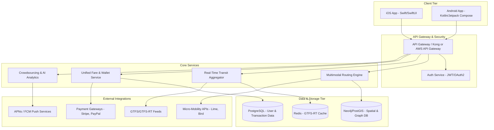

# System Architecture: Trassit Companion

This document details the phase-wise architecture designed to address the challenges outlined in the [ProblemStatement.md](file:///d:/NAYAN-Nextleap/Trassit_Companion/docs/ProblemStatement.md). 

---

## 1. High-Level Architecture Overview

Trassit Companion follows a modern, cloud-native, microservices-based architecture to ensure high availability, scalability, and seamless integration with diverse third-party APIs (GTFS feeds, micro-mobility, and payment gateways).

---

## 2. Phase-Wise Architecture Plan

To minimize risk and ensure a stable launch, the architecture is divided into five execution phases starting from data acquisition (Phase 0).

### Phase 0: Data Sourcing & Web Scraping Setup (Pre-requisites)
**Objective:** Establish secure API connections, scraping jobs, and database schemas for all geospatial, transit feed, and disruption telemetry sources.

*   **Integrated Data Sources & URLs:**
    *   **National Open Data:** [data.gov.in](https://data.gov.in) & Ministry of Housing & Urban Affairs (MoHUA) smart city portals.
    *   **Geospatial & Community Maps:** [datameet.org](http://datameet.org) for Indian railways/metro GIS shapes.
    *   **Transit Registries:** [mobilitydatabase.org](https://mobilitydatabase.org) and [transit.land](https://www.transit.land) for GTFS static and real-time feeds.
    *   **Commercial & Mapping APIs:** [chalo.com](https://chalo.com) for real-time bus tracking and [apis.mapmyindia.com](https://apis.mapmyindia.com) (Mappls) for localized Indian route navigation.
    *   **Weather Alerts:** India Meteorological Department (IMD) — [mausam.imd.gov.in](https://mausam.imd.gov.in) for weather condition feeds.
    *   **Service Disruption Scraper:** X/Twitter API listeners targeting State Road Transport Corporations handles (KSRTC, MSRTC, APSRTC, etc.).
*   **Key Components:**
    *   **API Auth & Credential Manager:** Secure vault for MapMyIndia, X/Twitter, Transit.land, and Data.gov.in API keys.
    *   **Scraper Cron Jobs:** Automated scripts to poll static schedule datasets periodically.

### Phase 1: Foundation & Real-Time Transit Data Aggregation (Core MVP)
**Objective:** Build the core pipeline to ingest static transit data (GTFS) and live transit updates (GTFS-RT), and render basic schedules and routes on client devices.

This phase is broken into five incremental subphases, each producing a testable deliverable:

#### Sub-Phase 1A: Database & Schema Setup
**Goal:** Provision and configure the primary persistent stores.
*   Set up **PostgreSQL** with the **PostGIS** extension.
*   Design and apply migration scripts for core tables:
    *   `agencies` – transit operator metadata.
    *   `routes` – route ID, short/long name, route type (bus / rail / metro).
    *   `stops` – stop ID, name, latitude, longitude (PostGIS `GEOGRAPHY` point).
    *   `stop_times` – arrival/departure times per trip per stop.
    *   `trips` – trip ID → route mapping, service calendar reference.
    *   `shapes` – route polyline geometries (PostGIS `LINESTRING`).
    *   `calendar` / `calendar_dates` – service day rules and exceptions.
*   Provision a **Redis** instance (local Docker or managed) with namespaced key prefixes (`trassit:rt:*`).
*   Write a health-check script that verifies connectivity to both stores.

#### Sub-Phase 1B: GTFS Static Feed Parser
**Goal:** Download, unzip, and parse GTFS static zip files into PostGIS tables.
*   **GTFS Ingestion Service & Chunking Strategy:**
    *   To prevent Out-Of-Memory (OOM) errors on large feeds (e.g. 5M+ `stop_times` rows), the parser must use a **chunk-and-flush** streaming pattern.
    *   The incoming file stream is paused every `N` rows (e.g., 5,000 rows), flushed to PostgreSQL in bulk, the memory array cleared, and the stream resumed.
*   Build a service (Node.js) that:
    1.  Accepts a GTFS zip URL.
    2.  Downloads and extracts the zip.
    3.  Parses each `.txt` file using a streaming CSV reader.
    4.  Upserts rows in bulk transactions.
*   Implement a **feed versioning** mechanism.
*   Add a CLI command: `npm run phase1:import -- --url <gtfs_zip_url>`.

#### Sub-Phase 1C: GTFS-RT Live Stream Processor
**Goal:** Poll GTFS-RT protobuf feeds and normalize live vehicle positions & trip updates.
*   Integrate the `gtfs-realtime-bindings` npm package to decode Protocol Buffer payloads.
*   Build a **poller loop** (configurable interval: 10–30 seconds) that:
    1.  Fetches the protobuf binary from a GTFS-RT endpoint URL.
    2.  Decodes `FeedMessage` → extracts `TripUpdate`, `VehiclePosition`, and `Alert` entities.
    3.  Normalizes each entity into a flat JSON structure.
*   Emit events for downstream consumers.

#### Sub-Phase 1D: Redis Cache Layer & API Endpoints
**Goal:** Serve real-time transit data through fast cache reads and expose REST endpoints.

*   **Design Redis Key Schema & Pipelining (Reflecting GTFS-RT Feed Realities):**
    *   `trassit:vehicle:{vehicle_id}` → JSON hash of latest coordinates, heading, speed, and current stop association (TTL 60s).
    *   `trassit:route:{route_id}:vehicles` → Set of active vehicle IDs on this route for O(1) route-live queries (TTL 60s).
    *   `trassit:trip:{trip_id}:delay` → Integer delay offset in seconds updated by TripUpdates (TTL 300s).
    *   `trassit:alert:{alert_id}` → JSON representation of active service alerts (TTL 1 hour).
    *   **Pipelining Strategy:** All parsed updates from a GTFS-RT feed must be batched and written to Redis via `redis.pipeline()` in a single atomic network call, avoiding connection bottlenecks.
*   **Build Express.js REST API Endpoints:**
    *   `GET /api/v1/routes` → Lists all active routes from PostgreSQL.
    *   `GET /api/v1/routes/:routeId/stops` → Ordered stops for a route with geometries.
    *   `GET /api/v1/stops/:stopId/arrivals` → Merges static scheduled arrival times from PostgreSQL with active trip delay offsets in Redis to compute precise real-time ETAs.
    *   `GET /api/v1/vehicles/live?route=:routeId` → Fetches vehicle IDs from `trassit:route:{route_id}:vehicles` and resolves positions from `trassit:vehicle:{vehicle_id}`.
    *   `GET /api/v1/alerts` → Returns active alerts cached in Redis.
*   **Add request validation, error handling, and structured JSON responses.**

#### Sub-Phase 1E: Basic Map UI (Web Client)
**Goal:** Render transit routes and live vehicle positions on an interactive map.
*   Build a lightweight **web client** (vanilla HTML/CSS/JS or a minimal framework):
    *   Use **Leaflet.js** with OpenStreetMap tiles (free, no API key needed).
    *   Display route polylines fetched from `GET /api/v1/routes/:id/stops`.
    *   Show live vehicle markers that auto-refresh every 15 seconds from `GET /api/v1/vehicles/live`.
    *   Display an "Arrivals" panel when a stop marker is tapped, pulling from `GET /api/v1/stops/:id/arrivals`.
    *   Show a dismissible banner bar for active service alerts.
*   Ensure the UI gracefully degrades: if Redis returns empty (no live data), fall back to static scheduled times with a "Scheduled" badge.

*   **Infrastructure & Database (Phase 1 Summary):**
    *   **PostgreSQL with PostGIS** extension for spatial geometries of lines and stations.
    *   **Redis** for high-throughput live coordinate and arrival caching.
    *   **Express.js** for the REST API layer.
    *   **Leaflet.js** for the map-based web UI.

### Database Retrieval & Optimization Strategy
To achieve low latency under peak load:
1.  **Dual-Store ETA Merge:** The API must resolve candidate arrival times from SQL indexes (`idx_stop_times_stop_arr`), then query trip delay offsets (`trip:{trip_id}:delay`) using Redis **pipelining** to compute final estimated times.
2.  **GIST Proximity Searches:** Stop and shape lookups use PostGIS spatial indexes (`idx_stops_geom` and `idx_shapes_geom`) with `ST_DWithin` and `ST_Distance` to avoid full-table scans.
3.  **Active Set Indexing:** Instead of using scanning keys (e.g. `KEYS *`), active vehicle positions are resolved by fetching active vehicle IDs from a Redis Set index (`route:{route_id}:vehicles`) followed by pipelined hash retrievals.

---

### Phase 2: Multimodal Integration & First/Last Mile Routing
**Objective:** Enable commuters to find routing options that blend public transit with micro-mobility options (scooters, bikes) and walking.

*   **Key Components:**
    *   **Multimodal Routing Engine:** Powered by **OpenTripPlanner (OTP)** or **Valhalla**, utilizing OpenStreetMap (OSM) data. This engine computes routes that combine transit networks with pedestrian paths.
    *   **Micro-Mobility Aggregator:** A scheduler that queries external APIs (using GBFS standards) to track nearby e-scooters and bike-sharing hubs.
    *   **Decision Logic Engine (Groq LLM Integration):** A routing orchestrator that stitches together transit routes with micro-mobility choices to solve the "first-mile/last-mile" commute gap. It uses **Groq LLM** to analyze unstructured incident text alerts (from social media/IMD) to estimate delay minutes and adjust routing edge weights (penalizing outdoor legs during storms or street strikes).
*   **Infrastructure & Database:**
    *   **Neo4j / Graph Database** (optional/hybrid) to represent transit transfer networks, making pathfinding across different modes highly efficient.

---

### Phase 3: Unified Ticketing & Digital Wallet Integration
**Objective:** Securely integrate third-party payment processors and manage virtual transit tickets, allowing passengers to ride transit networks seamlessly.

> [!IMPORTANT]
> **PII URL Restriction:** If any query, checkout transaction, or validation operation fails, the system must NOT attach, log, or return any URL containing personal identifiable information (PII) like user names, emails, billing details, or authorization tokens.

*   **Key Components:**
    *   **Wallet Service:** Manages digital wallet balances, ticket purchases, and virtual pass generation using secure barcode tokens (e.g., QR codes) or transit-compliant NFC modules.
    *   **Transit Partner Integration Gateway:** Secure Webhooks and REST APIs to interact with transit providers' ticketing backends to validate and register fares.
    *   **Payment Gateway API:** Secure PCI-compliant wrapper (e.g., Stripe, Google Pay, Apple Pay) for user fare purchasing.
*   **Infrastructure & Database:**
    *   Strict transactional boundaries in **PostgreSQL** with audit logging to guarantee financial ledger consistency.
    *   End-to-end tokenization and encryption at rest for transit credentials.

---

### Phase 4: Crowdsourcing, AI Predictions & Scaling
**Objective:** Leverage user reports (crowdsourcing) and historical patterns to estimate occupancy and predict delays, scaling the system for mass use.

*   **Key Components:**
    *   **Crowdsourced Event Processor:** Event-driven pub/sub queue (e.g., **Apache Kafka** or **AWS SQS**) handling rapid check-ins, transit delays, and occupancy status updates submitted by active commuters.
    *   **Occupancy & Delay Prediction Service:** An AI/ML service that learns historical delay patterns and crowdsourced inputs to estimate bus/train crowding and notify users proactively.
    *   **Notification Engine:** Event-triggered push notifications via Firebase Cloud Messaging (FCM) and Apple Push Notification Service (APNs).
*   **Infrastructure & Database:**
    *   **Kafka** for processing high-velocity event streams.
    *   **Time-series database** (e.g., TimescaleDB) to store historical arrival offsets for delay forecasting.

---

## 3. Technology Stack Recommendation

| Component | Technology / Tool | Rationale |
| :--- | :--- | :--- |
| **Mobile Clients** | React Native / Flutter (or Native Swift & Kotlin) | High-performance mapping, background location polling, and digital ticket rendering. |
| **API Gateway** | Kong / Apigee | Robust rate-limiting, security token verification, and API routing. |
| **Backend Services** | Go (Golang) / Node.js (TypeScript) | High concurrency performance for processing heavy real-time data feeds. |
| **Routing Engine** | OpenTripPlanner (OTP) / Valhalla | Industry standard open-source engines for multimodal pathfinding. |
| **Main Database** | PostgreSQL + PostGIS | Enterprise-grade transactional safety combined with top-tier spatial capabilities. |
| **Fast Cache** | Redis | Sub-millisecond read times for volatile real-time vehicle positions. |
| **Event Streaming** | Apache Kafka / AWS SQS | Handles thousands of incoming crowdsourced reports and live status feeds concurrently. |
| **LLM Provider** | Groq (Llama-3/Mixtral) | Low-latency inference for NLP tweet parsing, crowdsourced anomaly verification, and live delay predictions. |
